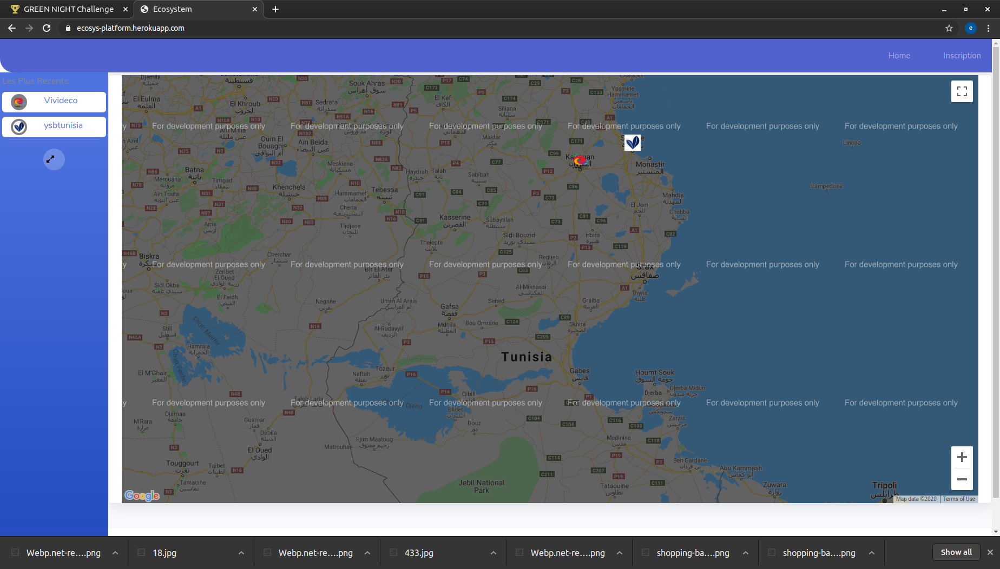

# Ecosystem Platform

## The Website is live at:

https://ecosys-platform.herokuapp.com/

##Status

We are still working on it, we still have to:

---> Add the functionality to let users add new items and a profile to manage items.
---> Add the functionality to display each item's info in a new page
---> Add more styling to the project

# How can you add new items

visit the dashboard at: https://ecosys-platform.herokuapp.com/admin
login with this account (admin:admin)
And there, you can add categories and items

# echnologies used in this project
---> HtML
---> Bootstrap
---> CSS
---> JavaScript
---> Django
